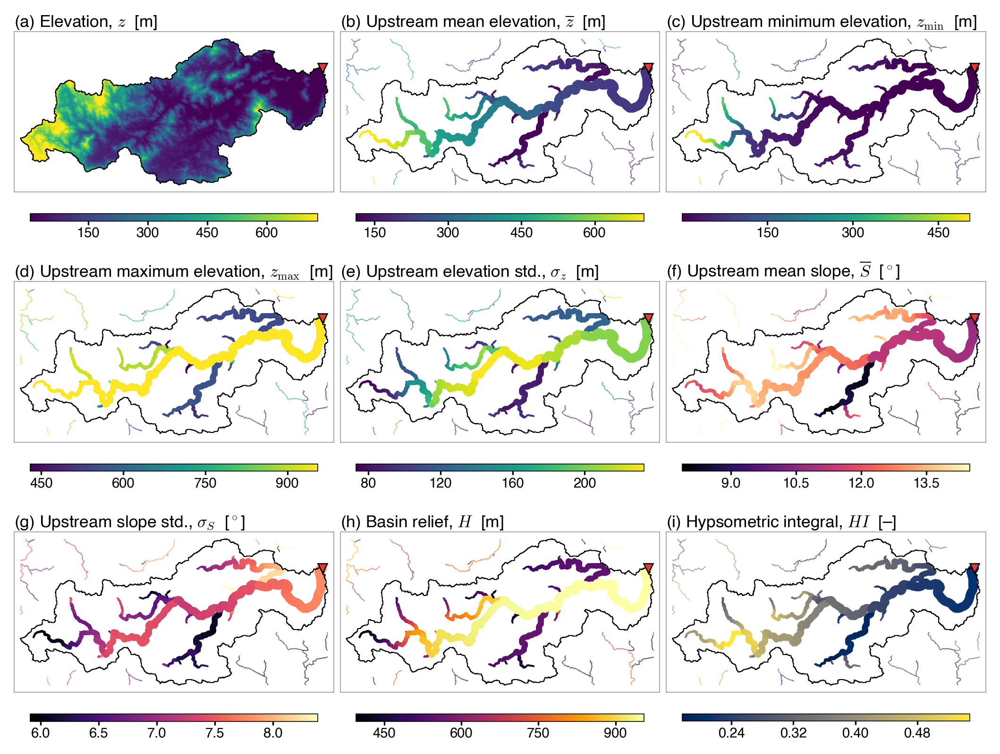
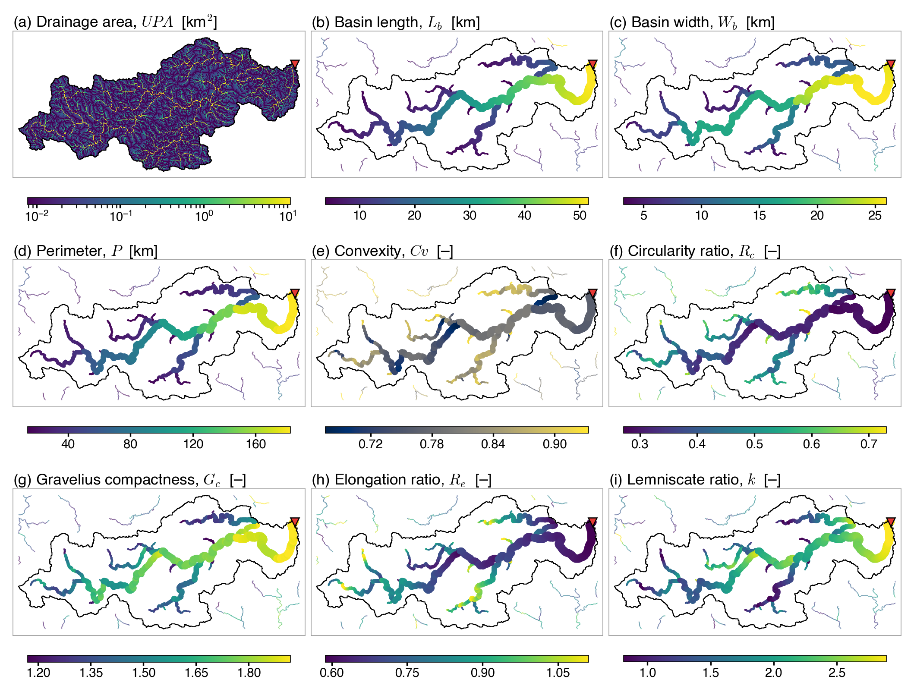

# FlowMorph

The shape and terrain of every pixel's upstream catchment on a D8 flow-direction grid.

For every pixel whose upstream drainage area is at least 10 km², FlowMorph computes sixteen attributes of the
catchment that drains to it. By how they are computed they fall into three groups: six upstream aggregates of
elevation and slope, taken in one pass over the flow tree; four planform metrics traced from the catchment boundary
(perimeter, basin length, basin width and convexity); and six arithmetic derivatives (basin relief, the hypsometric
integral and four dimensionless shape indices). By use they regroup into eight terrain statistics and eight
basin-shape metrics, shown below. These are the sixteen per-pixel upstream attributes of the FullBasin dataset
(Table 3 of the FullBasin paper, Jiang et al., under review at Earth System Science Data). The FullBasin v1.0 layers
were computed with an earlier version; what differs is listed in the
[user guide](docs/user-guide.md#differences-from-the-fullbasin-v10-layers).

Tested on MERIT Hydro at 3 arc-seconds, on three regions, the largest of 10.7 million pixels (178,129 of them with
10 km² or more upstream).

[](docs/media/fullbasin_fig08_terrain.png)

*The eight terrain statistics on the example basin of the FullBasin paper (basin 8595, southeastern Fujian, China;
729 km², 3 arc-seconds): (a) elevation, for context; (b)–(g) the six upstream aggregates; (h) basin relief and (i) the
hypsometric integral. Each pixel with at least 10 km² upstream is drawn as a circle whose radius grows with
log10 of its upstream area, so the main stem stands out; the black line is the basin boundary and ▼ the outlet.
Figure 8 of the FullBasin paper.*

[](docs/media/fullbasin_fig09_shape.png)

*The eight basin-shape metrics on the same basin: (a) upstream drainage area, for context; (b)–(e) the four
planform metrics; (f)–(i) the four shape indices. Figure 9 of the FullBasin paper, drawn from the FullBasin v1.0
layers. This package takes the convexity (e) from the convex hull of the pixels, not of their centres, and
`lemniscate_ratio` is Chorley's ratio of perimeters; panel (i) shows the parameter k = π L² / (4A) that FullBasin v1.0
stores under that name.*

Documentation, the global MERIT Hydro products and the other FullHydro tools: <https://fullhydro.org/tools/>

Author: Lulu Jiang (<https://lulujiang.me>)

## Install

```sh
git clone https://github.com/hellolulujiang/flowmorph.git
cd flowmorph
pip install -e ".[test]"
pytest
```

Python 3.10 or later with `numpy`, `numba`, `scipy` and `rasterio`.

## Use

```python
import flowmorph

fm = flowmorph.FlowMorph.from_raster("data/dir_example.tif", "data/upa_example.tif", "data/elv_example.tif")
attributes = fm.attributes()          # name -> float32 grid, -9999 where not written; read-only, .copy() to edit
fm.write("out")                       # seventeen GeoTIFFs: slp and the sixteen attributes
```

or from the command line:

```sh
python -m flowmorph data/dir_example.tif data/upa_example.tif data/elv_example.tif out
```

The bundled example is one basin of MERIT Hydro in Tasmania (696 km², 110,125 pixels, 2,033 of them with 10 km²
or more upstream).

## The sixteen attributes

Written where the upstream area is at least 10 km², -9999 elsewhere. A is the upstream area, P the perimeter, L the
basin length.

| # | layer | variable | unit | group | what |
|---|---|---|---|---|---|
| 1 | `mean_elv` | mean upstream elevation | m | upstream aggregate | mean elevation of the catchment's pixels |
| 2 | `min_elv` | minimum upstream elevation | m | upstream aggregate | lowest elevation |
| 3 | `max_elv` | maximum upstream elevation | m | upstream aggregate | highest elevation |
| 4 | `elv_std` | upstream elevation standard deviation | m | upstream aggregate | standard deviation of elevation (divided by n) |
| 5 | `mean_slp` | mean upstream slope | deg | upstream aggregate | mean local slope (Horn's 3 x 3 kernel) |
| 6 | `slp_std` | upstream slope standard deviation | deg | upstream aggregate | standard deviation of the local slope |
| 7 | `perimeter_km` | catchment perimeter, P | km | boundary walk | the outer boundary traced pixel by pixel, weighted after Vossepoel & Smeulders (1982) |
| 8 | `basin_length_km` | basin length, L | km | boundary walk | distance from the pixel to the farthest boundary pixel (Rigon et al., 1996) |
| 9 | `basin_width_km` | basin width | km | boundary walk | span of the boundary across L, in a plane centred on the pixel (Rigon et al., 1996) |
| 10 | `convexity` | convexity | - | boundary walk | A over the area of the convex hull of the catchment's pixels, at most 1 (Willemin, 2000) |
| 11 | `relief` | basin relief | m | arithmetic | max_elv - min_elv (Strahler, 1952) |
| 12 | `hypsometric_integral` | hypsometric integral | - | arithmetic | (mean_elv - min_elv) / relief (Strahler, 1952); no data when the relief is 0 |
| 13 | `elongation_ratio` | elongation ratio | - | arithmetic | (2 / L) sqrt(A / pi) (Schumm's formula, with L) |
| 14 | `gravelius` | Gravelius compactness | - | arithmetic | P / (2 sqrt(pi A)) (Gravelius, 1914) |
| 15 | `circularity` | circularity ratio | - | arithmetic | 4 pi A / P² (Miller, 1953) |
| 16 | `lemniscate_ratio` | lemniscate ratio | - | arithmetic | perimeter of the lemniscate with area A and length L, over P (Chorley et al., 1957) |

Full definitions, the input rules and how it works: [user guide](docs/user-guide.md).

## Tests

```sh
pytest
```

The tests compare the bundled basin with its reference values and check the rules on small made-up grids.

## Citing

The attributes are described in the FullBasin paper (Jiang et al., under review at Earth System Science Data); a
citation file will be added once it appears. Until then cite this repository with the commit you used.

## Acknowledgements

**MERIT Hydro** (Yamazaki et al., 2019; [10.1029/2019WR024873](https://doi.org/10.1029/2019WR024873)) is the grid
FlowMorph was built on, and the source of the bundled example.

## Contact

<lulu_jiang@pku.edu.cn>, or an issue on this repository.

## Licence

MIT for the code; see [`LICENSE`](LICENSE). The bundled MERIT Hydro excerpt keeps its own terms; see
[`DATA_NOTICE.md`](DATA_NOTICE.md).
