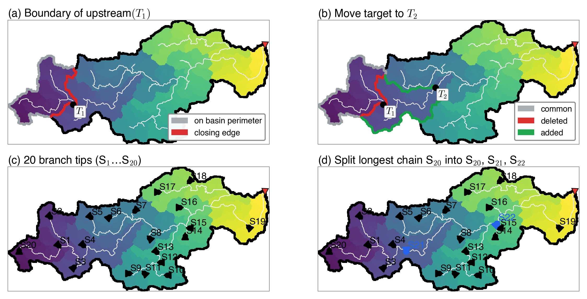

# FlowMorph user guide

The full reference for the Python package. The short introduction is the [README](../README.md).

## Input

Three grids of the same size, north up, in longitude and latitude (degrees):

* `dir`: flow directions in the MERIT Hydro convention, Byte: a power of two clockwise from east (1 E, 2 SE, 4 S,
  8 SW, 16 W, 32 NW, 64 N, 128 NE), 0 a river mouth and 255 an inland depression (both end a basin), 247 no data.
  The grid must hold whole basins: a pixel that flows out of the grid or into a cell without flow direction is
  refused, and so is a cycle.
* `upa`: the upstream area in km², MERIT Hydro's own. It chooses the pixels that get the attributes (finite and at
  least 10 km²; `min_upstream_area_km2` sets another threshold), it is the A of the ratios, and it orders the
  donors at a confluence.
* `elv`: the elevation in metres, -9999 where there is none. Every pixel of the network needs one.

The slope of a pixel on the edge of the grid needs its neighbours outside the grid. Give `ring_path` (a larger
elevation grid, typically the global one the grid was cut from) and they are read from there; without it they
take the centre value.

## Definitions

Besides the sixteen attributes (the table in the [README](../README.md)), the local slope `slp` is written as well. The docstrings of `flowmorph/terrain.py`,
`flowmorph/boundary.py` and `flowmorph/shape.py` give each definition in full: which pixels are on the boundary,
where the trace starts and stops, what counts as a corner, how the hull is drawn and how its area is taken, and the
two branches of the lemniscate.

Lengths and hull areas are on the WGS84 ellipsoid. `earth="sphere"` (`--earth sphere`) measures them on the
authalic sphere of radius 6,371,007.181 m instead.

## How it works

The pixels of each basin are numbered depth first from the outlet, the larger upstream area first at every
confluence, and the numbering is turned so that the outlet comes last (FlowTopo's `seq_dfs`). The catchment of a
pixel p, p included, is then the run of ranks `[seq_dfs(p) - upg(p) + 1, seq_dfs(p)]`, where `upg` is its number of
upstream pixels, and "is q upstream of p" is two comparisons.

* Terrain: the ranks are taken from 0 up. When the pixel of rank r is reached, the sums of the catchments flowing
  into it are on the top of a stack; they are taken off and added to r's own values, and r's sums go back on the
  stack. One pass, no per-pixel accumulators.
* Plan form: the pixels with 10 km² or more upstream are taken upstream first. A run of them each of whose
  catchment holds the one before is walked with one set of boundary pixels, grown from one catchment to the next:
  only the pixels new to the catchment are tested, and only the old boundary pixels next to them are tested again.

*The boundary walk on the example basin of the FullBasin paper (basin 8595, southeastern Fujian, China; 729 km²),
coloured by the depth-first rank; white, the pixels with at least 10 km² upstream; ▼, the outlet. (a) For a target
T₁ on the main stem, the boundary of its catchment: the part on the basin perimeter (grey) and the closing edge
inside the basin (red). (b) Moving the target downstream to T₂, the new boundary follows from the old one: pixels
kept (grey), deleted (red) and added (green). (c), (d) How the streams of the basin, and three parts of the main
stem, were shared among threads for the FullBasin run; this package walks them one after another. Figure 7 of the
FullBasin paper.*

`seq_dfs` and `upg` can be given (`seq_dfs=`, `upg=`, for example FlowTopo's layers); they are then checked
against the flow directions before they are used.

## The grid's transform

A GeoTIFF header carries the pixel size and the origin in decimal, and their last bits are noise (1/1200 written as
0.00083333, say). The transform is therefore cleaned before it is used (`flowmorph.grid.snap_transform`): the pixel
size goes back on 1/N of MERIT Hydro's or HydroSHEDS' grid, the origin back on the grid of half pixels, and every term
is rounded to 1e-12 degree. A window cut out of a larger grid has another origin, and the last bits of some pixel
centres move with it: on the bundled basin, 16 slopes and 3 attributes differ in their last place from the same
pixels computed on the larger region, which is why the example test compares to a relative 5e-7.

## Run time

One run, on a MERIT Hydro region in a window of 6,000 by 7,200 cells holding 10.7 million pixels (178,129 of them with
10 km² or more upstream), takes 41 s on one thread and at most 7.5 GB of memory (its largest resident set), with the
slope's ring read from the global elevation (`ring_path=`, `--ring`).

## Differences from the FullBasin v1.0 layers

The FullBasin v1.0 layers were computed with an earlier version of FlowMorph. This version computes the same sixteen
attributes with these differences:

* the convex hull of the convexity is that of the pixels, not of their centres; the centres' hull is half a pixel
  short all round, so a small catchment came out too convex;
* lengths, edges and hull areas are on the WGS84 ellipsoid, the earth of MERIT Hydro's upstream area (FullBasin
  v1.0: a sphere); `earth="sphere"` gives those lengths back;
* the area A is MERIT Hydro's own upstream area;
* the boundary trace stops when it is back at its start and its next step would repeat its first (the earlier
  version stopped at the first return, and left out a part of the catchment joined to the rest only through the
  start pixel);
* the width is taken in one plane centred on the outlet, and a trace that does not come back gives no data;
* `lemniscate_ratio` is Chorley's ratio of perimeters; FullBasin v1.0 stores the parameter k under that name, which
  equals 1 / elongation_ratio²;
* the slope of a pixel at the edge of a region reads its neighbours from the global elevation.

## What the tests check

`tests/test_example.py` runs the bundled basin and compares every attribute with its reference values;
`tests/test_contracts.py` checks the rules and the refusals on small grids made up for the purpose.
